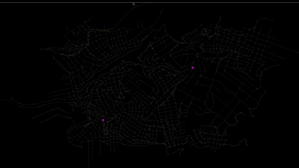

## 🗺️ Proyecto: UnsaGraph

Este programa permite construir y guardar "N" rutas óptimas por cada mapa con una visualización interactiva, utilizando diferentes algoritmos de búsqueda.

  

### Algoritmos utilizados:

- Dijkstra
- Depth First Search
- Breadth First Search
- Best First Search
- AStar

## 🎮 Controles de Interacción

| **Tecla / Acción**  | **Función**                                                                                 |
|:-------------------:|:-------------------------------------------------------------------------------------------:|
| `L` (Left)          | Mostrar / Ocultar etiquetas del mapa actual                                                 |
| `N` (Next)          | Cambiar al siguiente mapa (en un bucle de 5 mapas)                                          |
| `P` (Previous)      | Retroceder al anterior mapa (en un bucle de 5 mapas)                                        |
| `Click Izquierdo`   | Seleccionar el punto de inicio y el punto de destino en el mapa (permite varias rutas)      |
| `R` (Run)           | Calcular, animar y dibujar la ruta más corta entre los puntos seleccionados (si existe)     |
| `B` (Break)         | Saltar animación de búsqueda                                                                |
| `F` (Finish)        | Saltar animación de ruta corta encontrada                                                   |
| `M` (Math)          | Cambiar al siguiente Algoritmo (en un bucle de 5 algoritmos)                                |
| `C` (Clear)         | Limpiar las rutas dibujadas en el mapa actual                                               |
| `ESC`               | Salir del programa                                                                          |
| **Vista / Zoom**    | **Función**                                                                                 |
| `Q`                 | Alejar vista                                                                                |
| `E`                 | Acercar vista                                                                               |
| `A` `W` `S` `D`     | Mover vista a Izquierda / Arriba / Abajo / Derecha respectivamente                          |

## 🔧 Requisitos
- Librería: SFML 3.0.0
- Compilador para C++: gcc, g++, Clang, MSVC, TCC, ICC
- Herramienta para optimizar compilación y dependencias: Make
- SO: Linux, macOS o Windows
